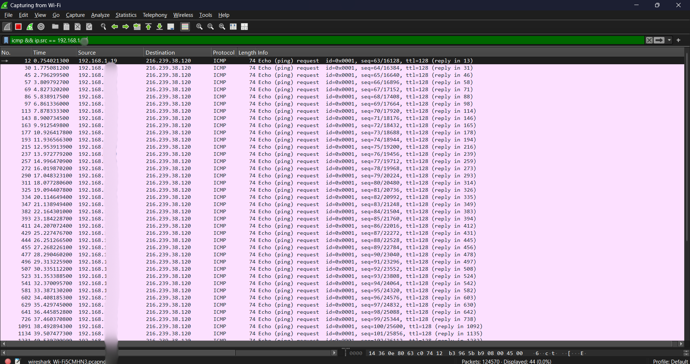
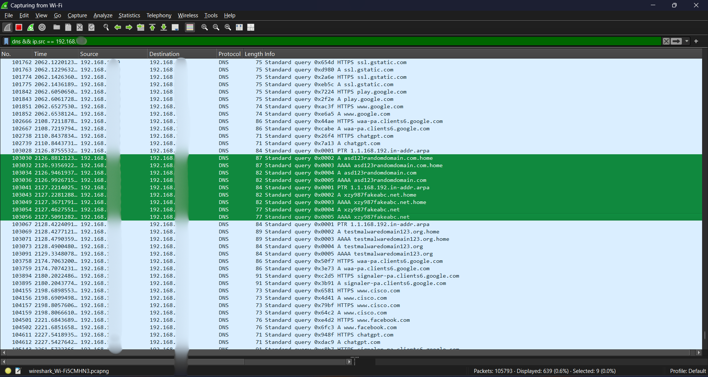
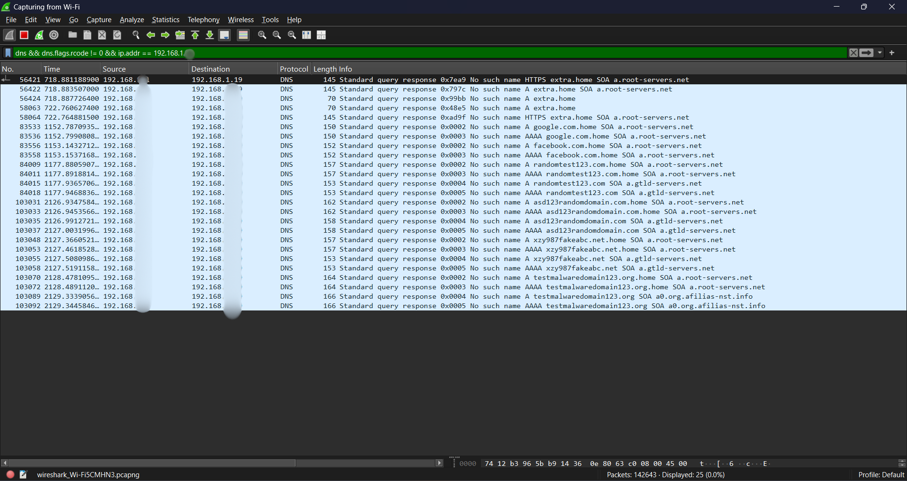
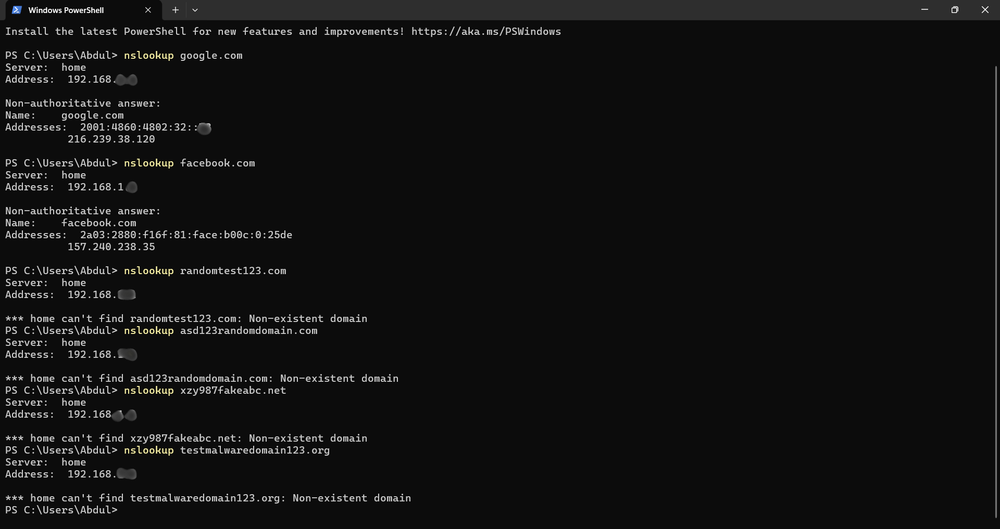
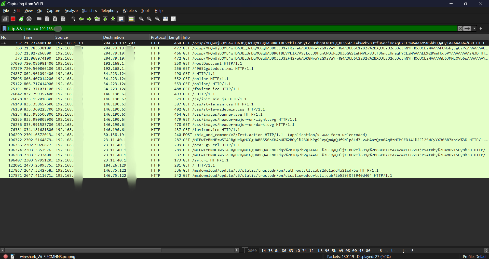

# 🛡️ SOC Analyst Simulation – Traffic Investigation

## 📌 Overview

This project simulates a real-world SOC investigation analyzing ICMP, DNS, and HTTP traffic using Wireshark.

## 🎯 Objectives

* Detect abnormal ICMP behavior
* Identify suspicious DNS queries
* Analyze NXDOMAIN responses
* Examine HTTP security risks
* Correlate multi-protocol activity

## 🧰 Tools

* Wireshark
* Command Prompt
* Web Browser

## 📸 Evidence

### ICMP Traffic

### DNS Queries

### DNS Failed (NXDOMAIN)

### Simulation (nslookup)

### HTTP Traffic

---

## 🧠 Key Findings

* Continuous ICMP traffic detected
* Suspicious DNS queries observed
* NXDOMAIN responses identified
* HTTP traffic is unencrypted

---

## 🚨 Threat Analysis

The observed behavior may indicate:

* ICMP flood patterns
* Domain Generation Algorithm (DGA)
* Potential command-and-control activity
* Exposure to MITM attacks

---

## 📄 Report

Full professional report:
➡️ SOC_Investigation_Report.pdf

---

## 🎤 Interview Summary

"I conducted a multi-protocol traffic analysis using Wireshark and identified suspicious patterns across ICMP, DNS, and HTTP traffic."
